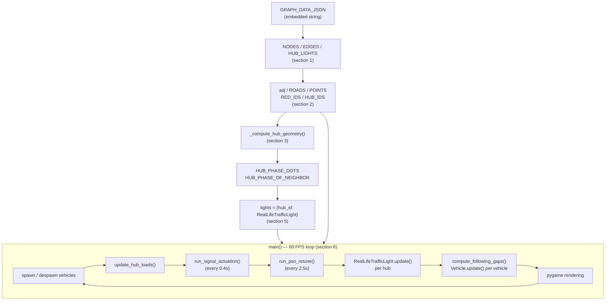

# Road Simulation — Technical Reference

`road_simulation.py` is a self-contained `pygame` simulation of a small road
network with metaheuristic-optimized, load-aware traffic signals. It models:

- a fixed road graph (loaded from an embedded JSON blob),
- 3 real 4-way signalized intersections ("hubs"), each with 2 conflicting
  phases (like North-South vs East-West),
- a fleet of vehicles that spawn from random origins, drive to random
  destinations, and disappear on arrival,
- a **Particle Swarm Optimization (PSO)** controller that continuously
  retunes how the signals prioritize traffic, using each hub's live queue
  load and how long each approach has been waiting.

This document explains the architecture, the algorithms, and every
function/method's contract, so a new developer (or a reviewer) can follow the
code without re-deriving the design from scratch.

---

## 1. Quick Start

```bash
pip install pygame numpy
python util/road_simulation.py
```

A window opens showing the road network. Colored dots at 3 intersections are
traffic signals; small circles are vehicles (red-outlined/larger = emergency
vehicle). Per-hub text next to each intersection shows live diagnostics:
`A:green A1.2 B0.3 g14s` reads as *"phase A is green, phase A's smoothed load
is 1.2, phase B's is 0.3, this hub's current safety-cap green time is 14s."*

---

## 2. Core Concepts

| Concept | What it means here |
|---|---|
| **Node** | A point in the road graph. `type` is `"plain"` (pass-through junction), `"red"` (a valid trip origin/destination), or `"light"` (a signalized hub). |
| **Edge** | A road segment between two nodes, stored as a polyline (`pts`) so curved roads render correctly. |
| **Hub** | A `"light"` node — a real 4-way intersection with 2 **phases** (two crossing roads). Only one phase can be green at a time. |
| **Phase (`"A"` / `"B"`)** | One of the two conflicting traffic streams at a hub, e.g. the N-S road vs the E-W road. Determined purely from the geometry of each hub's 4 signal dots. |
| **Lane** | Each direction of travel on an edge is rendered on its own side of the road (a lateral offset), so opposing traffic doesn't visually overlap, and vehicles going the same way car-follow instead of passing through each other. |
| **Load** | A smoothed (EMA), distance-weighted count of vehicles approaching a hub on a given phase — the live "how much traffic is waiting here" signal. |
| **Wait time** | How long (seconds) a phase has gone without being served. Used to guarantee a heavily-waiting phase eventually wins even under close/tied load, preventing starvation. |
| **Metaheuristic (PSO)** | Two independent Particle Swarm Optimization passes periodically retune (a) each hub's green-time safety cap and (b) the load/wait weighting used to decide *when* to switch — both driven from live network data, not hardcoded. |

---

## 3. High-Level Architecture



### Per-frame sequence (what actually happens every tick of `main()`)

1. **Spawn/despawn** — maybe add a new `Vehicle` (random origin/destination) at
   a randomized interval; maybe add an emergency vehicle on a slower random
   interval. Vehicles that finished their trip last frame are filtered out.
2. **Sense** (`update_hub_loads`) — recompute each hub's per-phase queue load
   from current vehicle positions, folded into an exponential moving average.
3. **Actuate** (`run_signal_actuation`, every `ACTUATION_INTERVAL`) — apply
   emergency preemption if any ambulance is close to a hub; otherwise tell
   each hub whether it has enough total demand to bother going green at all.
4. **Retune** (`run_pso_retune`, every `PSO_INTERVAL`) — run the two PSO
   passes: one re-optimizes each hub's green-time safety cap, the other
   re-optimizes the shared load/wait decision weights.
5. **Tick lights** — each `RealLifeTrafficLight.update(dt)` advances its own
   phase state machine (see §5).
6. **Move vehicles** — `compute_following_gaps` groups vehicles by lane, then
   every `Vehicle.update(dt, gap)` advances (or holds) each vehicle, checking
   its own approach's signal and the vehicle ahead of it.
7. **Render** — roads, signal dots (colored per-phase), vehicles, HUD.

---

## 4. Data Model (`GRAPH_DATA_JSON`)

```jsonc
{
  "nodes": { "<id>": { "x": 0.0, "y": 0.0, "type": "plain|red|light" }, ... },
  "edges": [ { "a": "<id>", "b": "<id>", "pts": [[x,y], ...] }, ... ],
  "hub_lights": { "<hub_id>": [[x,y], [x,y], [x,y], [x,y]] }   // 4 dot positions per hub
}
```

Derived module-level structures (built once at import time):

| Name | Type | Meaning |
|---|---|---|
| `NODES` | `dict[str, dict]` | Raw node records, keyed by string id. |
| `POINTS` | `dict[str, (x,y)]` | Node id → coordinate, used everywhere for distance math. |
| `EDGES` | `list[dict]` | Raw edge records (`a`, `b`, `pts`). |
| `ROADS` | `list[(str,str)]` | `(a, b)` id pairs, used by the routing cost graph. |
| `RED_IDS` | `list[str]` | Node ids valid as vehicle trip origins/destinations. |
| `HUB_IDS` | `list[str]` | Node ids that are signalized intersections. |
| `HUB_LIGHTS` | `dict[str, list[(x,y)]]` | Each hub's 4 rendered signal-dot positions. |
| `adj` | `dict[str, list[(neighbor, edge_idx, length)]]` | Adjacency list, built from `EDGES`. |
| `HUB_PHASE_DOTS` | `dict[str, {"A":[idx,...], "B":[idx,...]}]` | Which of a hub's 4 dots belong to which phase. |
| `HUB_PHASE_OF_NEIGHBOR` | `dict[str, dict[str,str]]` | For a hub, which phase an *incoming* neighbor's traffic belongs to. |
| `lights` | `dict[str, RealLifeTrafficLight]` | One controller instance per hub. |
| `hub_load_ema` | `dict[str, {"A":float,"B":float}]` | Smoothed per-hub, per-phase load. |

---

## 5. Traffic Signal Control — Design Deep-Dive

### 5.1 Two-phase intersection model

Each hub's 4 signal dots are split into two **antipodal pairs** — the two
roads crossing at that intersection — by `_pair_hub_dots`, which tries all 3
ways to pair up 4 points and keeps whichever pairing has each pair's vectors
(relative to the hub center) summing closest to zero (i.e. most "opposite").

`_compute_hub_geometry` then classifies every *incoming* road at a hub into
phase `"A"` or `"B"` by comparing the road's arrival angle (mod 180°, since a
road's two directions belong to the same phase) against each phase-pair's
axis angle. This is why only one of the two phases can be green: they are the
two real, physically-conflicting streams of traffic, not an artificial split.

Exactly one phase is green (`active`) at a time; the other is always red.
Switching goes through the standard **green → yellow → all-red → green**
sequence to guarantee a clearance gap.

### 5.2 Why it's load-driven, not time-driven

The naive version of this (a fixed max-green timer) makes a phase turn
yellow after N seconds *even if the opposite road is empty* — the "signals
work on a fixed cycle" problem. Instead, `RealLifeTrafficLight.update()`
computes a **priority score** per phase:

```
score(phase) = load[phase] * LOAD_WEIGHT + wait_time[phase] * WAIT_WEIGHT
```

- `load[phase]` — smoothed count of vehicles currently approaching on that
  phase (§5.3).
- `wait_time[phase]` — seconds since that phase was last served; reset to 0
  the instant it goes green, incremented every tick otherwise. This is the
  starvation guard: even a lightly-loaded phase's score eventually overtakes
  an actively-served phase's if it waits long enough.

A green phase ends when (checked every tick, once past `MIN_GREEN_TIME`):

1. `opposite_deserves_turn` — the red phase's load is above
   `GREEN_REQUEST_THRESHOLD` **and** its score beats the green phase's score
   by more than `PHASE_SWITCH_MARGIN` (hysteresis so near-tied phases don't
   flap back and forth every tick), **or**
2. `green_side_emptied` — the currently-green phase's own load has dropped to
   ~0 while the red phase actually has someone waiting (no reason to keep
   holding green for nobody), **or**
3. `hit_safety_cap` — a rarely-hit fairness backstop (`self.max_green`,
   PSO-tuned, defaults to a generous `MAX_GREEN_TIME`).

If none of those are true — e.g. the opposite road is empty — green is
**held indefinitely**. This was verified directly: with one phase loaded and
the other at zero load, the light stayed green through 40+ simulated
seconds with no forced cycling.

### 5.3 Load measurement

`compute_hub_loads` scans every non-emergency vehicle; if it's within
`DETECT_RADIUS` px of the hub it's heading to, it contributes a weight of
`1 - (distance / DETECT_RADIUS)` (closer = more weight) to that hub+phase's
raw load, using `HUB_PHASE_OF_NEIGHBOR` to know which phase its approach
belongs to. `update_hub_loads` folds this into an exponential moving average
(`EMA_ALPHA`) each frame so single-frame noise doesn't flicker the lights.

### 5.4 Emergency preemption

`apply_emergency_preemption` checks every emergency vehicle; if one is within
`EMERGENCY_PREEMPT_DIST` of its next hub, it calls
`RealLifeTrafficLight.request_emergency(phase)`, which:

- if that phase is already active, just makes sure it stays requested green;
- otherwise, if the *other* phase is currently green, fast-tracks it to
  yellow (by setting `timer = YELLOW_TIME` so the very next `update()` call
  advances it), and records `pending_phase` so the next red→green decision
  is forced to the emergency vehicle's phase instead of being scored normally.

This never bypasses the yellow/all-red clearance — it only skips the normal
scoring and shortens how long the conflicting phase stays green.

### 5.5 The two PSO passes

Both are the same generic PSO loop (16 particles, 12 iterations, standard
inertia/cognitive/social update), just with different search spaces and cost
functions — run every `PSO_INTERVAL` seconds inside `run_pso_retune()`.

**(a) `pso_optimize_green_times`** — one dimension per hub, searching
`[MIN_GREEN_TIME, MAX_GREEN_TIME]` for the green-time *safety cap* that
minimizes `_pso_cost`: a delay term (`load / green_time`) plus an economy
term (`0.15 * green_time`), with an extra penalty for giving a near-idle hub
a long cap. This is a rarely-triggered backstop, not the everyday driver
(see §5.2).

**(b) `pso_optimize_signal_weights`** — 2 dimensions, `LOAD_WEIGHT ∈ [0.2,3.0]`
and `WAIT_WEIGHT ∈ [0.0,1.0]`, searching for the weight pair that minimizes
`_signal_weight_cost`: for every hub and every ordered (loser, winner) phase
pair, it charges a penalty equal to *the loser's own load* times *how badly
it lost the arbitration*. In plain terms: it's directly penalizing the
"heavily-loaded phase keeps losing to a nearly-empty one" outcome, and
searching for the load/wait blend that avoids it. These two globals are
exactly the "waiting time + opposite vehicle load" formula the control logic
uses everywhere else — this is what makes the tuning itself metaheuristic,
not just the timing.

---

## 6. Vehicle Simulation — Design Deep-Dive

### 6.1 Lifecycle

A `Vehicle` is created with a random origin and destination (both from
`RED_IDS`), plans a route once (`replan`), and drives it. On reaching the
destination it sets `self.active = False` and stops updating — `main()`
filters inactive vehicles out of the list every frame. New vehicles are
spawned continuously from `main()` at randomized intervals
(`SPAWN_INTERVAL_RANGE` for regular traffic, `EMERGENCY_SPAWN_RANGE` for
emergency vehicles), up to `MAX_VEHICLES`. This spawn/despawn churn is
deliberate: a fixed, endlessly-looping fleet keeps total network load
constant and makes the adaptive signal behavior uninteresting to observe;
random arrivals + finite trips create organic bursts of congestion on
different approaches at different times.

### 6.2 Routing

`metaheuristic_qpso_route` builds several (8) randomly-perturbed copies of
the road graph — each edge's weight is nudged by noise, a "hierarchy"
penalty that discourages minor roads unless there's no choice, and a signal
delay/bonus depending on the destination node's current effective signal
state (`effective_state`, which is phase-aware — see §6.4) — runs Dijkstra
(`get_noisy_shortest_path`) on each, and keeps whichever candidate path has
the lowest true geometric length. This is a lightweight stochastic
multi-restart search, not a literal Quantum-PSO implementation; the name is
kept from the original codebase (see §8, "Known limitations").

### 6.3 Two-lane rendering

`Vehicle.pos` computes the vehicle's position along its current segment,
then offsets it perpendicular to its *instantaneous direction of travel* by
`LANE_OFFSET` px, always to the same side (the right, by convention). Because
opposite-direction travel has an opposite tangent vector, this automatically
puts oncoming traffic on the other half of the same physical road polyline —
no separate "lane" edges are needed in the graph data.

### 6.4 Signal compliance

A vehicle only cares about the signal state *as seen from its own approach*:
`RealLifeTrafficLight.effective_state(neighbor)` returns the real state only
if `neighbor`'s phase matches the currently active phase, otherwise `"red"`.
This is what makes a vehicle correctly stop for a red phase even while the
*other* phase at the same hub is green.

### 6.5 Car-following (no overtaking)

`compute_following_gaps` groups all vehicles by `(edge, direction)` — i.e. by
lane — every frame, sorts each group by progress along the segment, and for
every vehicle that has one ahead of it in the same lane, records the gap
distance. `Vehicle.update` then caps its own advance so it can never close
nearer than `MIN_FOLLOW_GAP` px to the vehicle ahead — verified directly: a
trailing vehicle stops at a 0.2px gap rather than overlapping the leader.

---

## 7. Function & Method Reference

### Section 2 — Routing & Graph Utilities

| Name | Purpose | Inputs | Output |
|---|---|---|---|
| `calculate_dist(p1, p2)` | Euclidean distance between two points. | `p1, p2`: `(x, y)` tuples | `float` distance |
| `poly_len(pts)` | Total length of a polyline. | `pts`: list of `(x, y)` | `float` length |
| `edge_points(edge_idx, from_id)` | Get an edge's points ordered so travel starts at `from_id`. | `edge_idx`: int index into `EDGES`; `from_id`: node id | `list[(x,y)]`, possibly reversed |
| `get_centrality(node, points, roads)` | Degree-based centrality (0..1), cached globally on first call. | `node`: id; `points`, `roads`: graph data (only used to build the cache once) | `float` in `[0, 1]` |
| `get_noisy_shortest_path(noisy_graph, start, target)` | Dijkstra over a weighted graph. | `noisy_graph`: `dict[node, dict[node, weight]]`; `start`, `target`: node ids | `list[str]` path (falls back to `[start, target]` if unreachable) |
| `metaheuristic_qpso_route(start, target, traffic_lights, vehicles=None, is_emergency=False)` | Stochastic multi-restart shortest path that accounts for current signal states. | `start`, `target`: node ids; `traffic_lights`: the `lights` dict; `vehicles`: unused list (kept for signature compatibility); `is_emergency`: bool | `list[str]` node path |

### Section 3 — Traffic Light Controller

| Name | Purpose | Inputs | Output |
|---|---|---|---|
| `_pair_hub_dots(hub_id)` | Split a hub's 4 dots into 2 antipodal phase-groups. | `hub_id`: str | `{"A": [idx,...], "B": [idx,...]}` |
| `_circular_dist(a, b, period)` | Shortest distance between two angles on a circle of given period. | `a, b`: radians; `period`: e.g. `math.pi` | `float` |
| `_compute_hub_geometry()` | Build phase-dot groups and neighbor→phase maps for every hub. | none (reads module globals) | `(HUB_PHASE_DOTS, HUB_PHASE_OF_NEIGHBOR)` |
| `RealLifeTrafficLight.__init__(hub_id)` | Construct a hub's controller. | `hub_id`: str | — |
| `RealLifeTrafficLight._other()` | The phase that is not currently active. | — | `"A"` or `"B"` |
| `RealLifeTrafficLight._score(phase)` | Priority score for a phase (load + aged wait). | `phase`: `"A"`/`"B"` | `float` |
| `RealLifeTrafficLight.update(dt)` | Advance this hub's phase state machine by one tick (see §5.2). | `dt`: seconds elapsed | — (mutates `state`, `active`, `timer`, `wait_time`) |
| `RealLifeTrafficLight.set_target(wants_green)` | Record whether this hub has *any* demand at all. | `wants_green`: bool | — |
| `RealLifeTrafficLight.request_emergency(phase)` | Force-prioritize a phase for an approaching emergency vehicle. | `phase`: `"A"`/`"B"` | — |
| `RealLifeTrafficLight.effective_state(neighbor)` | Signal state as seen by traffic arriving from `neighbor`. | `neighbor`: node id | `"red"`/`"yellow"`/`"green"` |
| `RealLifeTrafficLight.dot_state(dot_idx)` | Render color for one of the hub's 4 dots. | `dot_idx`: int 0-3 | `"red"`/`"yellow"`/`"green"` |

### Section 4 — Vehicle Simulation

| Name | Purpose | Inputs | Output |
|---|---|---|---|
| `Vehicle.__init__(idx, is_emergency=False)` | Create a vehicle with a random origin/destination and plan its route. | `idx`: int (id/color seed); `is_emergency`: bool | — |
| `Vehicle.replan()` | (Re)compute the route from `curr_node` to `dest`. | — | — |
| `Vehicle._load_current_segment()` | Cache the current path segment's points, length, and edge index. | — | — |
| `Vehicle.next_node` (property) | The node this vehicle is currently driving toward. | — | node id (or `curr_node` if trip finished) |
| `Vehicle.update(dt, ahead_gap=None)` | Advance the vehicle by `dt`: checks signal, checks the vehicle ahead, advances progress, or marks the trip complete. | `dt`: seconds; `ahead_gap`: optional gap in px to the vehicle ahead in the same lane (from `compute_following_gaps`) | — (mutates `progress`, `segment_idx`, `curr_node`, `active`, `waiting`) |
| `Vehicle.pos` (property) | Current screen position, offset into this vehicle's lane. | — | `(x, y)` |
| `compute_following_gaps(vehicles)` | Group vehicles by lane and compute each one's gap to the vehicle ahead. | `vehicles`: list of `Vehicle` | `dict[Vehicle, float]` (gap in px; vehicles with open road ahead are absent) |

### Section 5 — Optimization Controller

| Name | Purpose | Inputs | Output |
|---|---|---|---|
| `compute_hub_loads(vehicles)` | Raw (unsmoothed) per-hub, per-phase demand from current vehicle positions. | `vehicles`: list of `Vehicle` | `dict[hub_id, {"A":float,"B":float}]` |
| `apply_emergency_preemption(vehicles)` | Force-green the specific hub+phase each nearby emergency vehicle needs. | `vehicles`: list of `Vehicle` | `set[hub_id]` of hubs that were preempted this call |
| `_pso_cost(vec, hubs, loads)` | Fitness function for green-time optimization (lower is better). | `vec`: list of green-time floats, one per hub; `hubs`: `HUB_IDS`; `loads`: `dict[hub_id, float]` total load | `float` cost |
| `pso_optimize_green_times(loads)` | PSO search for each hub's green-time safety cap. | `loads`: `dict[hub_id, float]` total load per hub | `dict[hub_id, float]` optimized green time |
| `_signal_weight_cost(vec)` | Fitness function for load/wait weight optimization (lower is better). | `vec`: `[load_weight, wait_weight]` | `float` cost |
| `pso_optimize_signal_weights()` | PSO search for the network-wide `LOAD_WEIGHT`/`WAIT_WEIGHT` pair; assigns them as a side effect. | — (reads `hub_load_ema`, `lights[*].wait_time`) | — (mutates module globals `LOAD_WEIGHT`, `WAIT_WEIGHT`) |
| `update_hub_loads(vehicles)` | Refresh the smoothed `hub_load_ema` and push it into each `RealLifeTrafficLight.load`. | `vehicles`: list of `Vehicle` | — |
| `run_signal_actuation(vehicles)` | Apply emergency preemption, then tell each non-preempted hub whether it has any demand at all. | `vehicles`: list of `Vehicle` | — |
| `run_pso_retune()` | Run both PSO passes and apply their results. | — | — |

### Section 6 — Main Loop & Rendering

| Name | Purpose | Inputs | Output |
|---|---|---|---|
| `draw_dashed_centerline(screen, pts, color=(255,255,255), dash_len=6, gap_len=6)` | Draw a dashed line along a polyline (visual 2-lane-road cue). | `screen`: pygame surface; `pts`: polyline points; `color`, `dash_len`, `gap_len`: styling | — (draws to `screen`) |
| `main()` | Entry point: sets up pygame, the vehicle fleet, and runs the simulation loop described in §3. | — | — |

---

## 8. Tuning Parameters

| Constant | Default | Effect of increasing | Effect of decreasing |
|---|---|---|---|
| `MIN_GREEN_TIME` | 4.0s | Safer minimum, slower reaction to sudden opposite-side demand | Faster reaction, more flicker risk |
| `MAX_GREEN_TIME` | 45.0s | Looser fairness backstop, closer to pure demand-driven behavior | Reverts toward a fixed-cycle feel |
| `YELLOW_TIME` / `ALL_RED_TIME` | 2.0s / 1.0s | Longer/safer clearance, slower switching | Shorter clearance, faster switching |
| `GREEN_REQUEST_THRESHOLD` | 0.25 | Hub needs more traffic before actuating at all | Hub actuates on very light traffic |
| `PHASE_SWITCH_MARGIN` | 0.3 | More hysteresis, fewer near-tied flip-flops | More reactive but more prone to flapping |
| `LOAD_WEIGHT` / `WAIT_WEIGHT` | 1.0 / 0.15 (PSO-tuned live) | Larger `WAIT_WEIGHT` biases toward fairness/turn-taking; larger `LOAD_WEIGHT` biases toward serving whichever side has more cars right now | — |
| `DETECT_RADIUS` | 150px | Vehicles counted as "demand" from farther away | Only very close vehicles count |
| `EMA_ALPHA` | 0.2 | Faster-reacting (noisier) load signal | Smoother but laggier load signal |
| `EMERGENCY_PREEMPT_DIST` | 120px | Preemption triggers earlier | Preemption triggers later/closer |
| `LANE_OFFSET` | 3.5px | Wider visual separation between directions | Lanes render closer together |
| `MIN_FOLLOW_GAP` | 16px | Vehicles keep more distance (more visible queuing) | Vehicles pack tighter |
| `INITIAL_VEHICLES` / `MAX_VEHICLES` | 30 / 110 | Busier network from the start / higher traffic ceiling | Sparser traffic |
| `SPAWN_INTERVAL_RANGE` | (0.12s, 0.4s) | Lower bound tighter = faster spawns = busier network | Wider/slower = sparser network |
| `EMERGENCY_SPAWN_RANGE` | (10s, 20s) | More/less frequent emergency vehicles | — |
| `ACTUATION_INTERVAL` | 0.4s | Slower demand re-checks | Faster (more CPU) demand re-checks |
| `PSO_INTERVAL` | 2.5s | PSO retunes less often | PSO retunes more often (more CPU) |
| `PSO_PARTICLES` / `PSO_ITERS` | 16 / 12 | Better-quality PSO search, more CPU per retune | Cheaper but noisier search |

---

## 9. Known Limitations / Design Trade-offs

- **`metaheuristic_qpso_route` is not literal Quantum-PSO.** It's a
  stochastic multi-restart Dijkstra (perturb edge weights with noise, solve,
  keep the best of 8 tries). The name predates this round of changes. If a
  reviewer asks "is this really QPSO," the honest answer is: no, it's a
  cheap swarm-inspired exploration heuristic for routing; the rigorous PSO
  implementation is the signal-timing optimizer in section 5.
- **Signal-phase geometry assumes 4 dots per hub.** `_pair_hub_dots` falls
  back to an arbitrary first-half/second-half split if a hub doesn't have
  exactly 4 signal dots; this fallback isn't geometrically validated the way
  the 4-dot case is.
- **PSO gives a good-enough solution, not a proven optimum.** Both passes
  run a fixed, small particle/iteration budget every `PSO_INTERVAL` seconds
  to stay cheap enough for real time (60 FPS); they are not guaranteed to
  find the global minimum of their cost functions, only to converge toward
  a reasonable one quickly.
- **`import numpy as np` is currently unused** in this file — harmless, but
  worth removing in a cleanup pass.
- **Two-lane rendering is visual-only.** There's no actual second polyline
  in the graph data; lane separation is purely a rendering-time lateral
  offset plus a same-direction car-following constraint. This is sufficient
  for the current visualization but wouldn't support, e.g., lane-specific
  turn restrictions without further work.

---

## 10. Anticipated Reviewer Questions

**Q: Why PSO instead of a Genetic Algorithm or Simulated Annealing for the
signal tuning?**
PSO handles small, continuous, low-dimensional search spaces (here: 3
green-time values, or 2 weight values) very cheaply and converges in very
few iterations — a good fit for a search that has to re-run every couple of
seconds inside a real-time loop. GA's crossover/mutation machinery and SA's
cooling schedule add complexity without a clear benefit at this scale.

**Q: How do you prevent one phase from starving the other?**
The `wait_time` aging term in the priority score (`_score`) guarantees a
phase's priority keeps climbing the longer it goes unserved, so it
eventually overtakes even a phase with somewhat higher load. This was
verified directly: under exactly equal load on both phases, they alternate
roughly every 8 seconds instead of one winning forever.

**Q: How do emergency vehicles get priority safely?**
`request_emergency` only ever targets the *specific phase* the vehicle's
approach belongs to, and always goes through the same yellow → all-red →
green sequence (just with the timer fast-forwarded) — the "only one phase
green at a time" invariant is never bypassed.

**Q: How is a real intersection (not a single shared signal) modeled?**
`_compute_hub_geometry` derives two phase groups from the hub's dot geometry
and classifies every incoming road into one of them by comparing arrival
angles. Load, wait time, and signal state are all tracked and reasoned about
per-phase, not per-hub.

**Q: How do you stop vehicles from clipping through each other?**
Two mechanisms: (1) lateral lane offset makes opposite-direction traffic
render on separate sides of the same road automatically; (2)
`compute_following_gaps` + the gap check in `Vehicle.update` stop a vehicle
from closing nearer than `MIN_FOLLOW_GAP` px to whatever is ahead of it in
the same lane.

**Q: Why do vehicles disappear instead of looping forever?**
A fixed, endlessly-looping fleet holds total network load constant, which
makes the adaptive controller uninteresting to observe. Finite trips +
randomized spawn intervals create organic congestion bursts that vary by
time and approach — which is what actually exercises the load-based signal
logic.

**Q: What's the performance cost of all this at scale?**
Per-frame vehicle/gap work is O(number of vehicles). The two PSO passes are
O(hubs × particles × iterations) = O(3 × 16 × 12) and only run once every
`PSO_INTERVAL` seconds, not every frame. A headless 30-second simulation at
~50-60 concurrent vehicles completed in ~0.14s of wall-clock compute,
confirming this is nowhere near a bottleneck at the current scale.

**Q: Is the routing optimization aware of the two-phase signal model?**
Yes — `metaheuristic_qpso_route` calls `effective_state(u)` (not the raw
`state`), so its signal-delay heuristic for a candidate route already
reflects which specific approach phase a vehicle would be arriving on.
